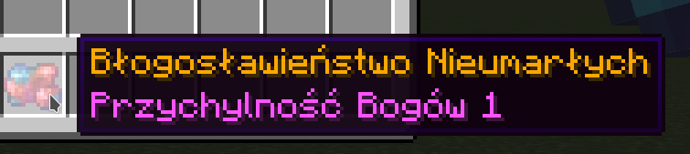
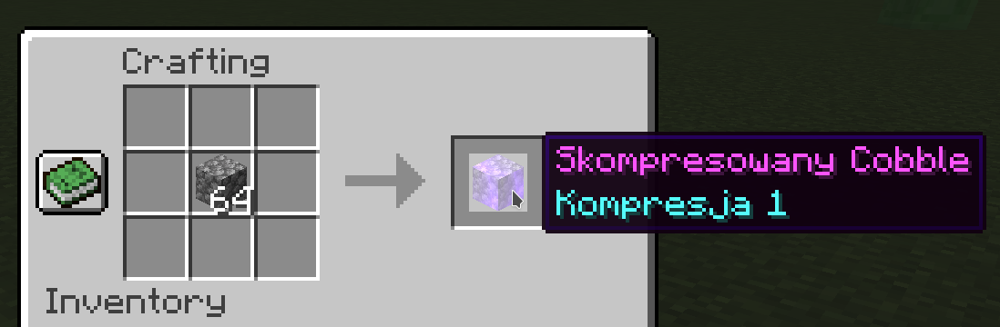
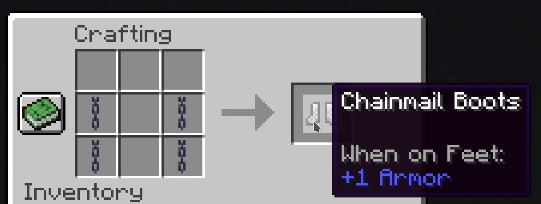

# GitmanikPlugin

GitmanikPlugin PaperMC plugin containing minor tweaks and additions to SMP. Fully customizable from YAML!

Currently supporting Minecraft 1.18.1

## Installation

### Easy way

Download `GitmanikPlugin-*.jar` from Releases and drop it into your server's `/plugins` folder

### From scratch
No additional libraries are required.

```package``` project with Maven and put target JAR  into your server's `/plugins` folder

# Plugin features

## Custom diamond drop system
<p align="center">
  
</p>
Plugin adds odds to dropping diamond from diamond ore, countering diamond inflation every server gets. (default: 70%)
</br>
Fortune now only adds percentage to dropping one diamond, instead of multiplying it. (default: 1 -> +10%, 2 -> +20%, 3 -> +30%)
<table>
<tr>
  <td width=50%>
  
  </td>
  <td width=50%>
    
  </td>
</tr>
</table>

When mining a diamond with a pickaxe with Fortune enchantment, and breaking a diamond there is a chance (default: 1 -> +10%, 2 -> +20%, 3 -> +30%) to drop `Blessing from Undead` item allowing one-time keepInventory when player dies.

## Quality-of-Life features
### Crush stone into 2 gravels in Stonecutter
<p align="center">
  
</p>

### Proximity chat
<p align="center">
  
</p>
 To counter chat spam, chat is proximity-based. To message globally, prefix your message with `G `, eg. `G Anyone wants to buy diamonds?`


### Skipping night system:
  * Chance for vote appearing
  * When majority of players vote, night is skipped

### Paid Home system (/dom /ustawdom)
  * Built-in delay for eliminating cheesing
  * Cost and delay are configurable from YAML

### Paid teleportation system between players
  * Built-in delay for eliminating cheesing
  * Cost and delay are configurable from YAML

- Potion stacker (/p) (gitmanik.stackpotions)
- Admin command (/gpadmin) (gitmanik.admin)

## Custom items
<table>
<tr>
  <td width=50%>
    
    <p> Used for crafting Mruwi Pickaxe </p>
  </td>
  <td width=50%>
    
    <p> Allows you to efficiently strip-mine 2x1 tunnels!</p>
  </td>
</tr>
<tr>
  <td width=50%>
  
  <p> Compressed items! Configurable</p>
  </td>
  <td width=50%>
    
    <p> Decompressed items! </p>
  </td>
</tr>
<tr>
  <td width=50%>
  
  <p> Held in offhand allows you to plant 3x3 patches of seed! Only 1000 uses though!</p>
  </td>
  <td width=50%>
    
    <p> Allows you to access your ender chest 25 times </p>
  </td>
</tr>
<tr>
  <td width=50%>
  
  <p> Chainmail boots..</p>
  </td>
  <td width=50%>
    
    <p> ..leggings..</p>
  </td>
</tr>
<tr>
  <td width=50%>
  
  <p> ..chestplate..</p>
  </td>
  <td width=50%>
    
    <p> ..and helmet! </p>
  </td>
</tr>
</table>

## Configurability

GitmanikPlugin is configurable via `plugins\GitmanikPlugin\config.yml` file.
File is automatically created if it does not exist on startup with default values shown below:

```yaml
enableChainmailRecipes: true
enableCobbleToGravelStonecutter: true
enableCompressedItems: true
#Material enum values like OBSIDIAN, BEDROCK
allowed_TUNNELDIGGER_blockList: [STONE, DIORITE, ANDESITE, GRANITE]

customItems:
  enable: true
  enableMruwiKlejnot: true
  enableMruwiKilof: true
  enableMagicznaOrchidea: true
  enableBlogoslawienstwoNieumarlych: true
  enableEnderowyDepozyt: true

#fortuneDiamondDrop is additional dropchance per fortune lvl added to baseDropChance
diamondsystem:
  enable: true
  baseDropChance: 0.7
  fortuneDropChance: 0.1

blessingsystem:
  drop: 0.1

tunneldigger:
  enable: true

skipsystem:
  enabled: true
  chance: 0.7

chatsystem:
  enabled: true
  range: 200

homesystem:
  enabled: true
  material: DIAMOND
  price: 3
  delay: 30

teleportsystem:
  enabled: true
  material: DIAMOND
  price: 5
  delay: 30

stackpotion:
  enabled: true
```

## License
[GNU GPL V3.0](https://choosealicense.com/licenses/gpl-3.0/)
